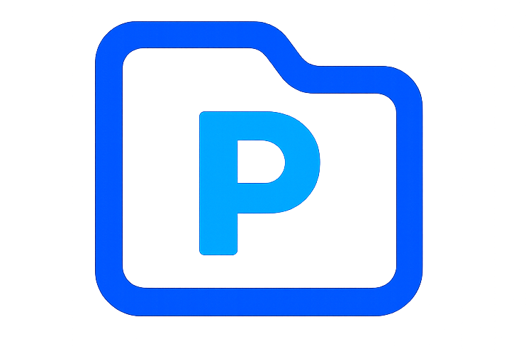

<p align="center">
  
</p>

# 🚀 Projex

[](CHANGELOG.md)
[](#)

Projex is a sleek, cross-platform desktop application that helps you manage and organize local project folders with ease. Featuring advanced tagging, lightning-fast search, favorites, and quick access workflows, it’s designed to boost productivity for developers, creators, and teams.

📋 **[View Changelog](CHANGELOG.md)** | 🚀 **[Latest Release v1.0.0](CHANGELOG.md#100---2025-01-15)**

## ✅ Implemented Features

### 🎯 Core Features
- [x] **Add Projects** - Select local folders with intuitive folder picker
- [x] **Drag & Drop Support** - Add projects by dropping folders directly into the app
- [x] **Archive Projects** - Mark projects as "archived" to hide them without deletion
- [x] **Advanced Search** - Search by name, path, or tags with real-time filtering
- [x] **Smart Tagging System** - Assign multiple tags with visual tag management and usage count
- [x] **Quick Access** - One-click folder opening in file explorer
- [x] **Modern UI/UX** - Clean dashboard with responsive design

### 🎨 UI/UX Enhancements
- [x] **Dark Mode** - Toggle between light and dark themes with system preference detection
- [x] **Improved Visual Design** - Modern cards with gradients, shadows, and animations
- [x] **Enhanced Sidebar** - Better filtering interface with visual indicators
- [x] **Responsive Layout** - Adaptive grid system for different screen sizes
- [x] **Smooth Animations** - Fade-in effects and hover transitions
- [x] **Visual Feedback** - Loading states, hover effects, and interactive elements
- [x] **View Toggle** - Switch between grid and list view modes for project display

### ⭐ Advanced Features
- [x] **Favorites/Pinned Projects** - Star system with separate favorite section
- [x] **SQLite Database** - Lightweight, reliable local storage
- [x] **Enhanced Project Creation** - Modal dialog with tag input during project addition
- [x] **Modal Editing Interface** - Professional edit dialogs with form validation
- [x] **Project Management** - Delete projects with confirmation
- [x] **Activity Tracking** - Track when projects were last accessed
- [x] **Smart Sorting** - Sort by date added, name, or last opened
- [x] **Tag Filtering** - Multi-select tag filters with clear options
- [x] **Tag Usage Count** - Display how many projects use each tag
- [x] **Multi-select Actions** - Select multiple projects and apply bulk delete, tag, or favorite
- [x] **Project Statistics** - Display total projects and favorites count

### 🔧 Technical Features
- [x] **Electron Framework** - Cross-platform desktop application
- [x] **React Frontend** - Modern component-based UI
- [x] **TailwindCSS** - Utility-first styling with dark mode support
- [x] **Heroicons** - Beautiful, consistent icon system
- [x] **Local Storage** - Theme preferences persistence
- [x] **IPC Communication** - Secure renderer-main process communication

### 📋 Pending Features
- [ ] **Auto-detect Projects** - Scan for package.json, requirements.txt, .git, etc.
- [ ] **Export/Import** - JSON backup and restore functionality
- [ ] **Cloud Sync** - Sync metadata with cloud services
- [ ] **IDE Integration** - Launch associated IDEs (VS Code, PyCharm, etc.)
- [ ] **Project Templates** - Quick project creation with templates
- [ ] **Recent Projects** - Quick access to recently opened projects

## Tech Stack

- **Frontend**: React + TailwindCSS + Heroicons
- **Backend**: Electron + Node.js
- **Database**: SQLite3
- **Build Tool**: Electron Builder

## Installation & Setup

1. Install dependencies:
```bash
npm install
cd frontend && npm install
```

2. Run in development mode:
```bash
npm run dev
```

3. Build for production:
```bash
npm run build
npm run dist
```

## Project Structure

```
project-management-app/
├── backend/
│   └── projects.db          # SQLite database
├── frontend/
│   ├── src/
│   │   ├── components/      # React components
│   │   ├── hooks/           # Custom hooks
│   │   └── App.js          # Main app component
│   └── public/
├── main.js                  # Electron main process
├── preload.js              # IPC bridge
└── package.json
```

## Usage

1. **Add Projects**: Click "Add Project" and select a folder, or drag & drop folders directly into the app
2. **Search**: Use the search bar to find projects by name or path
3. **Filter**: Use the sidebar to filter by tags
4. **Sort**: Choose sorting method (date added, name, last opened)
5. **Edit**: Click the pencil icon to edit project details
6. **Favorite**: Click the star icon to mark as favorite
7. **Open**: Click "Open Folder" to access the project directory

## 📋 Version History

- **v1.0.0** (Latest) - [Release Notes](CHANGELOG.md#100---2025-01-15)
  - Complete project management system with all core features
  - Dark mode, view toggle, favorites system
  - Background folder size calculation
  - Modern UI with animations and responsive design

For detailed changes and feature history, see the [CHANGELOG.md](CHANGELOG.md).